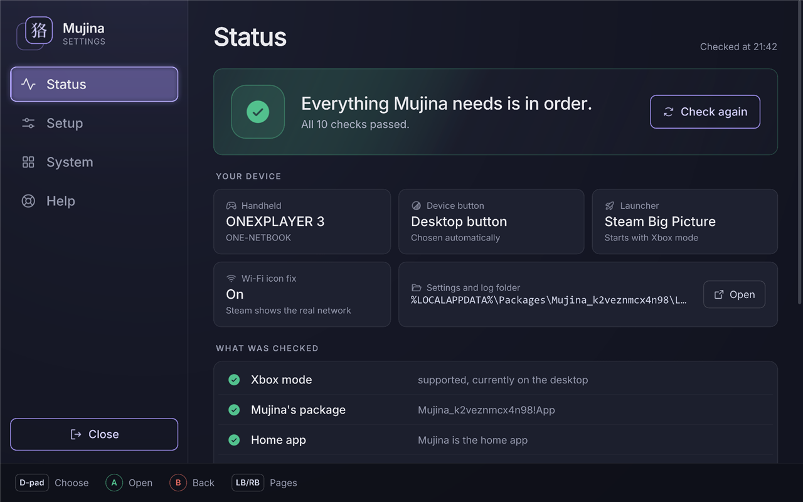
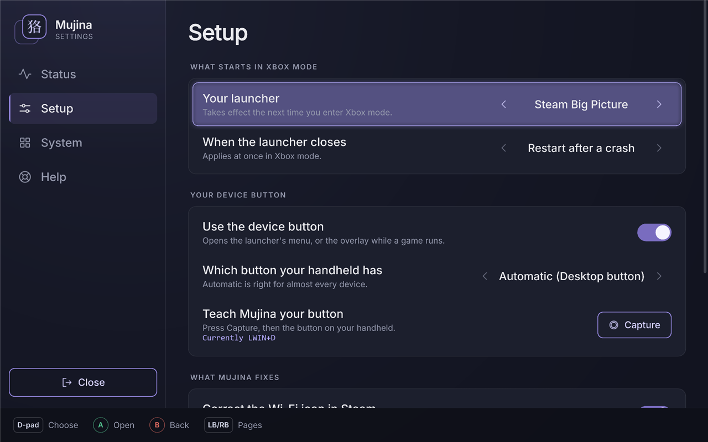
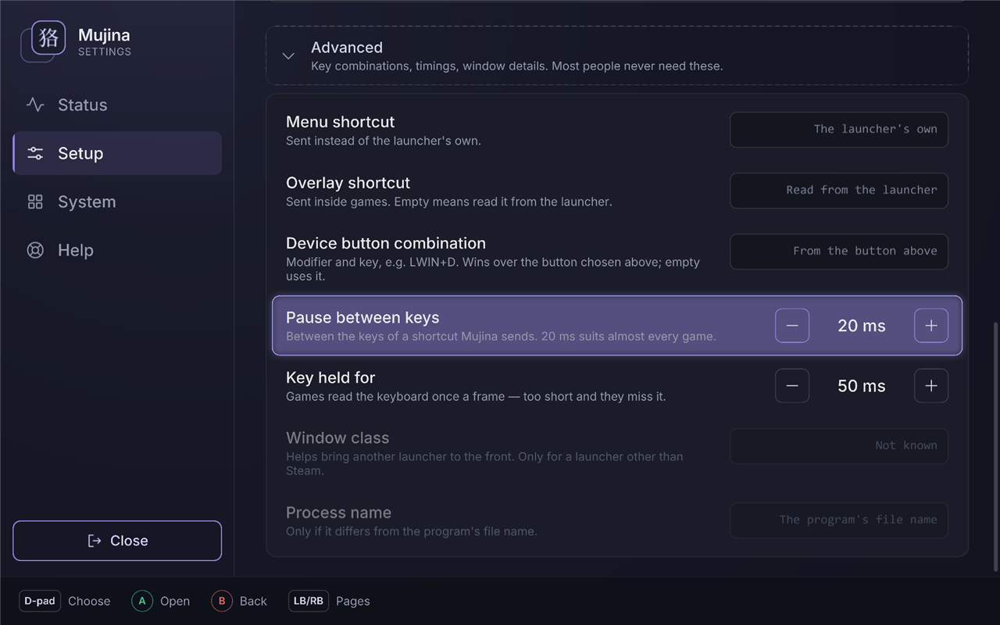
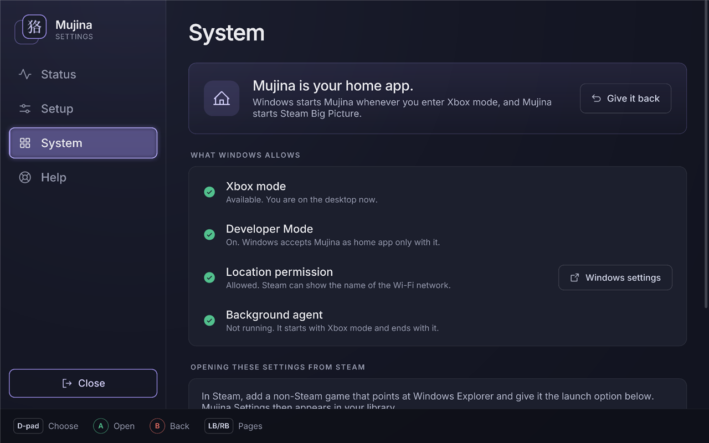

# Screenshots

Mujina Settings on a OneXPlayer 3, full screen as in Xbox mode. The purple frame is where the
controller is.

## Status

Does everything work? The checks, and what Mujina found on the device.

## Setup

What starts in Xbox mode, the device button, and what Mujina fixes.

Under *Advanced*: shortcuts and timings. Rows that only matter for another launcher are greyed
out while Steam is chosen.

## System

Whether Mujina is the home app, and what Windows allows it.

